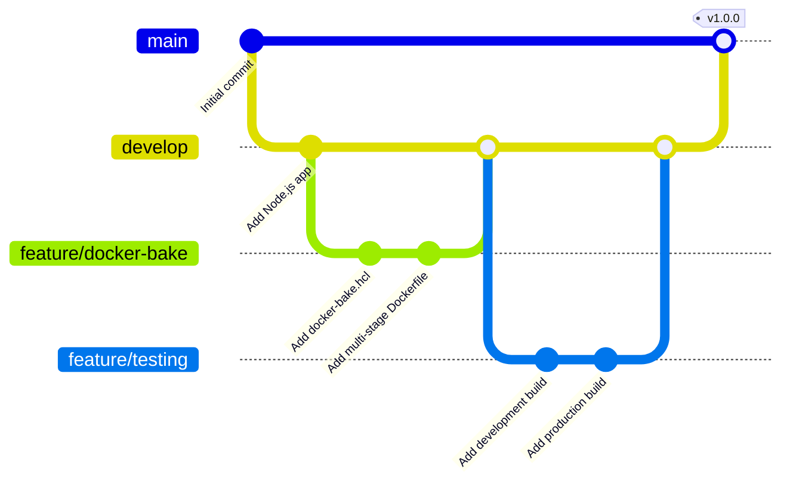

# Docker Bake Node.js Demo

This repository demonstrates how to use Docker Bake with a Node.js application.

## Development Workflow

The following Git graph shows our development workflow:



## Usage

### Development Build
```bash
docker buildx bake app-dev
```

### Production Build
```bash
docker buildx bake app-prod
```

### Multi-platform Build
```bash
docker buildx bake multi
```

## Verifying the Build

1. Check built images:
```bash
➜ docker images | grep docker-bake-demo
docker-bake-demo   dev   2908208abee0   56 seconds ago   357MB
```

2. Run the container:
```bash
➜ docker run -d -p 3000:3000 docker-bake-demo:dev
1a6ff844fd8ce520d01de14bfee88e907d90f4c6f03c8a1ea643b164c2373fa0
```

3. Test the application:
```bash
➜ curl http://localhost:3000
{"message":"Hello from Docker Bake Demo!","env":"development"}
```

## Project Structure

```
docker-bake-nodejs-demo/
├── docker-bake.hcl          # Docker Bake configuration
├── Dockerfile               # Multi-stage Dockerfile
├── package.json            # Node.js project configuration
├── src/
│   └── index.js           # Express.js application
└── README.md              # This file
```

## Features

- Multi-stage builds for development and production
- Environment-specific configurations
- Multi-platform build support
- Inheritance-based target configuration
- Group definitions for related builds

## Contributing

1. Fork the repository
2. Create your feature branch
3. Commit your changes
4. Push to the branch
5. Create a new Pull Request

## License

MIT